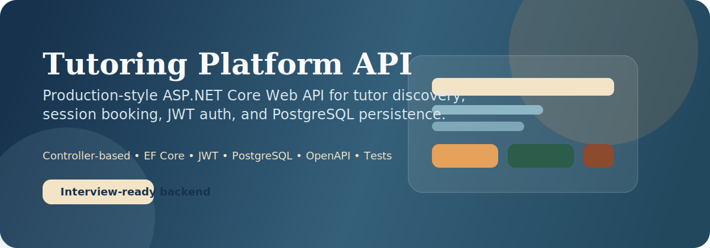
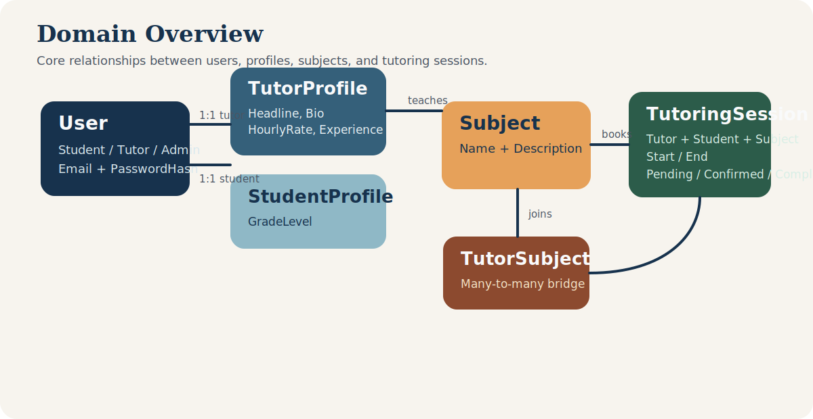
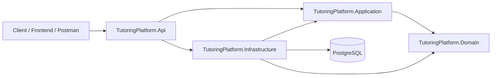

# Tutoring Platform API



[](https://dotnet.microsoft.com/)
[](https://learn.microsoft.com/aspnet/core)
[](https://www.postgresql.org/)
[](https://learn.microsoft.com/ef/core/)
[](https://jwt.io/)
[](https://xunit.net/)

A production-style ASP.NET Core Web API for a tutoring marketplace where students can discover tutors, manage subject expertise, and schedule tutoring sessions. The project is intentionally structured like something you could walk through in an interview: layered architecture, PostgreSQL with EF Core, JWT authentication, role-based authorization, DTO-first contracts, structured error handling, OpenAPI docs, health checks, and a repeatable local database workflow.

## Why This Project

This API is designed to demonstrate backend fundamentals that matter in real teams:

- clean separation between API, application, domain, and infrastructure concerns
- conventional controller-based ASP.NET Core design
- PostgreSQL persistence with EF Core migrations
- authentication and authorization with JWT bearer tokens
- DTO-based request and response contracts
- pagination, filtering, and sorting for list endpoints
- structured startup, configuration, logging, and error handling
- a local developer workflow with Docker, migrations, seed data, tests, and docs

## Visual Overview





## Feature Highlights

- `JWT auth` with `Student`, `Tutor`, and `Admin` roles
- `Tutor discovery` with pagination, filtering, and sorting
- `Session management` for booking and updating tutoring sessions
- `Subject management` with admin-only creation
- `ProblemDetails-style` error responses through centralized middleware
- `OpenAPI` document plus a lightweight docs UI at `/docs`
- `Health checks` exposed at `/health`
- `Development seed flow` with demo accounts and sample data
- `EF Core migrations` and a Docker-based PostgreSQL setup

## Tech Stack

- C# / ASP.NET Core Web API
- .NET SDK `10.0.101`
- Entity Framework Core
- PostgreSQL
- Npgsql
- JWT Bearer Authentication
- xUnit
- Docker Compose for local database setup

## Project Structure

```text
TutoringPlatform.Api/             HTTP layer, controllers, auth wiring, docs, middleware
TutoringPlatform.Application/     DTOs, contracts, mappings, pagination, app exceptions
TutoringPlatform.Domain/          Entities and enums
TutoringPlatform.Infrastructure/  EF Core, services, auth helpers, migrations, seeding
TutoringPlatform.Tests/           Unit tests
scripts/                          Local database and seed helper scripts
compose.yaml                      Local PostgreSQL container definition
```

### Layer Responsibilities

- `Api` keeps endpoints thin and focused on HTTP concerns
- `Application` defines the contracts the API exposes
- `Domain` models the core tutoring business objects
- `Infrastructure` owns persistence, auth primitives, migrations, and seeding
- `Tests` covers key mapping and security behaviors

## Core Domain

The current model centers around:

- `User`
- `TutorProfile`
- `StudentProfile`
- `Subject`
- `TutorSubject`
- `TutoringSession`

This lets the API represent tutor specialization, student identity, and subject-linked session scheduling in a clean, discussable way.

## API Surface

### Authentication

- `POST /api/auth/register`
- `POST /api/auth/login`

### Tutors

- `GET /api/tutors`
- `GET /api/tutors/{tutorUserId}`
- `PUT /api/tutors/profile`

### Subjects

- `GET /api/subjects`
- `POST /api/subjects`

### Sessions

- `POST /api/sessions`
- `GET /api/sessions/my`
- `PATCH /api/sessions/{sessionId}/status`

### Platform

- `GET /health`
- `GET /openapi/v1.json`
- `GET /docs`

### Development-Only Helpers

- `POST /dev/migrate`
- `POST /dev/seed`

## Authentication Model

The API uses JWT bearer authentication and role-based authorization.

- `Student` can register, browse tutors, and create tutoring sessions
- `Tutor` can manage their profile and update session status for their sessions
- `Admin` can create subjects and perform privileged operations

JWT configuration lives in:

- `TutoringPlatform.Api/appsettings.json`
- `TutoringPlatform.Api/appsettings.Development.json`
- `TutoringPlatform.Api/appsettings.Production.json`

## Development Docs

Once the API is running, open:

- `http://localhost:5280/docs`
- `http://localhost:5280/openapi/v1.json`
- `http://localhost:5280/health`

The `/docs` page is a lightweight embedded UI that reads the generated OpenAPI document.

## Local Setup

### 1. Restore

```powershell
dotnet restore .\TutoringPlatform.slnx --configfile .\NuGet.Config
```

### 2. Build

```powershell
dotnet build .\TutoringPlatform.slnx --no-restore
```

### 3. Run the API

```powershell
dotnet run --project .\TutoringPlatform.Api\TutoringPlatform.Api.csproj
```

## Local PostgreSQL Workflow

This repo includes a repeatable local database path for demos and development.

### Start PostgreSQL

```powershell
docker compose up -d postgres
```

Or use the helper script:

```powershell
.\scripts\start-dev-postgres.ps1
```

### Apply Migrations

```powershell
.\scripts\update-dev-database.ps1
```

### Start the API

```powershell
dotnet run --project .\TutoringPlatform.Api\TutoringPlatform.Api.csproj
```

### Seed Demo Data

```powershell
.\scripts\seed-dev-data.ps1
```

## Database and Migrations

The project uses EF Core migrations rather than `EnsureCreated`, which keeps the setup aligned with real-world deployment and makes the workflow easier to explain in interviews.

Key files:

- `TutoringPlatform.Infrastructure/Data/AppDbContext.cs`
- `TutoringPlatform.Infrastructure/Data/AppDbContextFactory.cs`
- `TutoringPlatform.Infrastructure/Data/Migrations/20260315133553_InitialCreate.cs`

To add a new migration later:

```powershell
dotnet tool restore
dotnet tool run dotnet-ef migrations add <MigrationName> `
  --project .\TutoringPlatform.Infrastructure\TutoringPlatform.Infrastructure.csproj `
  --startup-project .\TutoringPlatform.Api\TutoringPlatform.Api.csproj `
  --output-dir Data\Migrations
```

## Seeded Development Data

When PostgreSQL is available, the development seed creates a small but useful demo dataset.

### Demo Accounts

- `admin@tutoringplatform.dev` / `Admin123!`
- `ada@tutoringplatform.dev` / `Tutor123!`
- `grace@tutoringplatform.dev` / `Tutor123!`
- `student@tutoringplatform.dev` / `Student123!`

### Seeded Content

- four core subjects
- two tutor profiles
- one student profile
- one sample upcoming tutoring session

## Example Demo Flow

If you want to walk this project in a portfolio review or interview, this is a strong sequence:

1. Open `/docs` and show the endpoint catalog
2. Register or log in as a student
3. Browse tutors with filtering and sorting
4. Create a tutoring session
5. Log in as a tutor and update session status
6. Mention how the same flow is backed by layered architecture, DTO mapping, EF migrations, and JWT auth

## Testing

Run tests with:

```powershell
dotnet test .\TutoringPlatform.Tests\TutoringPlatform.Tests.csproj --no-build
```

Current tests focus on:

- password hashing behavior
- DTO mapping behavior

## Configuration

Environment-specific settings are defined in:

- `TutoringPlatform.Api/appsettings.json`
- `TutoringPlatform.Api/appsettings.Development.json`
- `TutoringPlatform.Api/appsettings.Production.json`

These cover:

- PostgreSQL connection strings
- JWT issuer, audience, and key settings
- logging levels

## Interview Talking Points

This project is a good portfolio piece because it gives you concrete examples to discuss:

- why DTOs are preferable to exposing EF entities directly
- why layered architecture improves maintainability
- how role-based authorization maps to real product behavior
- how migrations and seed data support developer onboarding
- how centralized exception handling improves API consistency
- how pagination/filtering/sorting should be handled in API design

## What Makes It Production-Style

- stable, conventional ASP.NET Core patterns
- dependency injection and configuration-driven startup
- PostgreSQL and EF Core with migration support
- environment-specific settings
- health checks and OpenAPI
- repeatable local developer workflow
- tests, seed data, and documented setup

## Current Status

Implemented today:

- layered solution structure
- JWT auth and role-based authorization
- tutor, subject, and session endpoints
- custom docs UI
- development migration and seed workflow
- initial migration and helper scripts

Good next steps if you want to continue:

- refresh tokens
- integration tests
- request tracing and audit logs
- CI pipeline
- rate limiting
- tutor availability scheduling

## Image Notes

You do **not** need to download any images to use this README right now. The visuals are already included in the repo:

- `assets/readme/banner.svg`
- `assets/readme/domain-overview.svg`

Optional images you may want to add later for an even stronger portfolio presentation:

- a screenshot of the `/docs` page after the API is running
- a Postman collection screenshot showing auth plus session creation
- an ERD exported from pgAdmin or dbdiagram for the final database model
